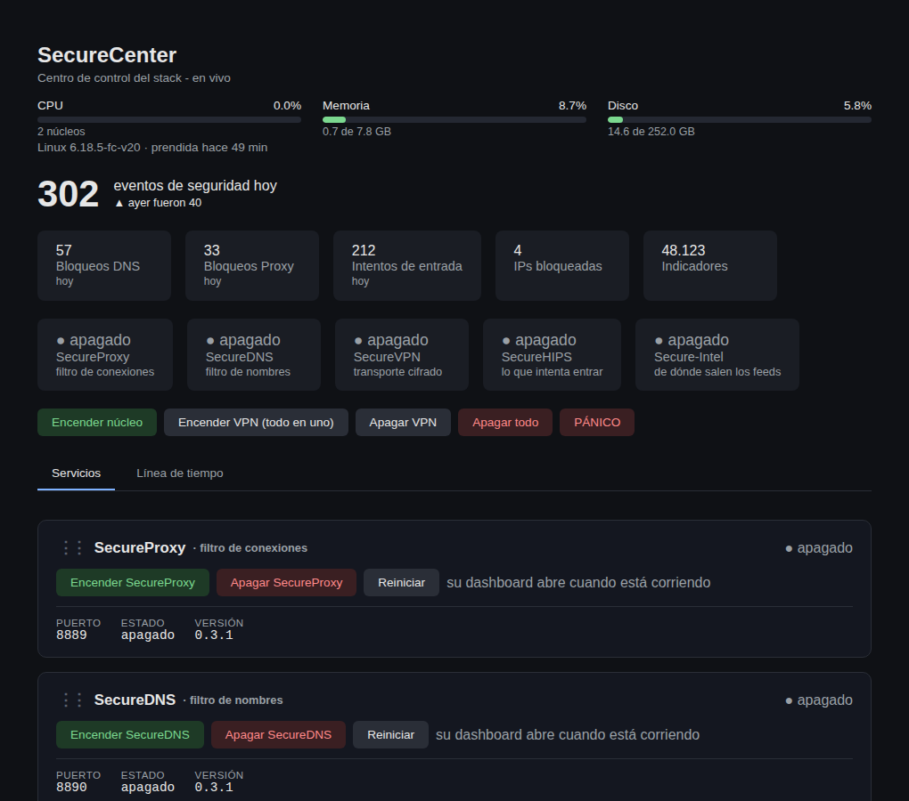
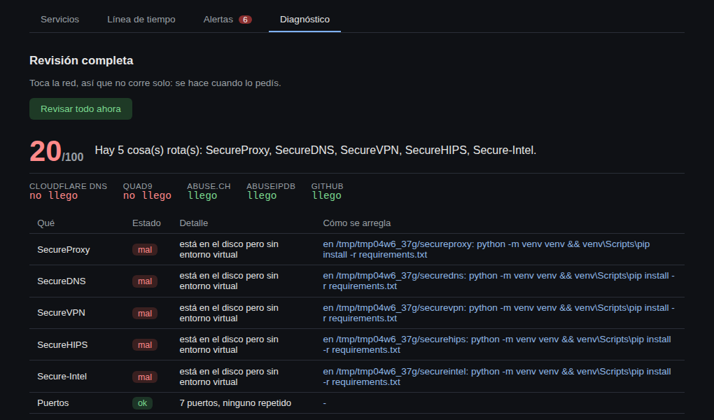
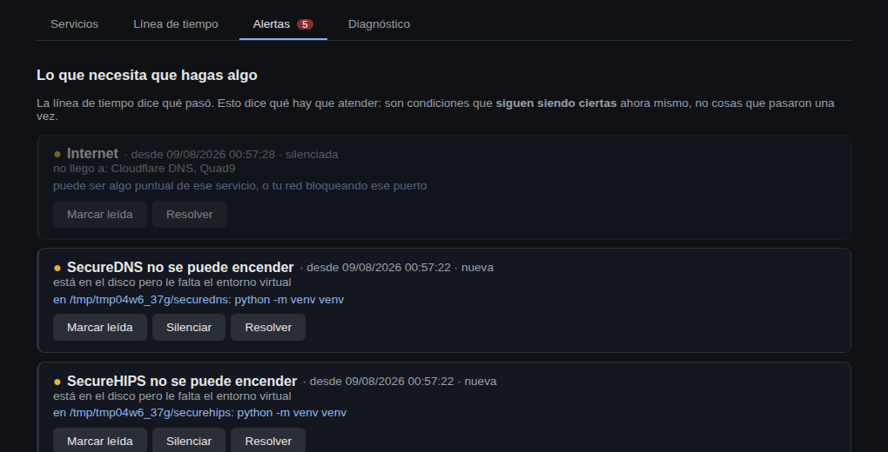
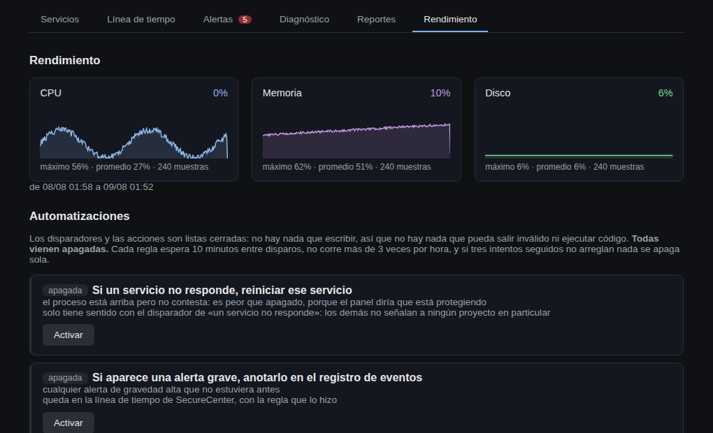

# SecureCenter


Centro de control unificado del stack personal de seguridad:
[SecureProxy](https://github.com/matiaselebi/secure-proxy) (filtro de
conexiones), [SecureDNS](https://github.com/matiaselebi/secure-dns) (filtro de
nombres), [SecureVPN](https://github.com/matiaselebi/secure-vpn) (transporte
cifrado), [SecureHIPS](https://github.com/matiaselebi/secure-hips) (respuesta
del host) y Secure-Intel (inteligencia compartida). Un panel y un dashboard
únicos para prender, apagar y ver los cinco desde un solo lugar. Secure-Detect
vive dentro de SecureCenter: normaliza los eventos de esos componentes, los
correlaciona y los agrupa en incidentes sin escribir reglas de firewall.

**No reimplementa nada de ellos**: los orquesta llamando a sus propios
scripts ([ADR 0001](docs/adr/0001-orquestar-no-reimplementar.md)). Cada
proyecto sigue siendo la fuente de verdad de sí mismo.

## Qué hace

- **Enciende el núcleo (SecureProxy + SecureDNS + SecureHIPS + Secure-Intel) con un botón**, y
  lo deja arrancando solo en cada inicio de Windows. Es el "siempre prendido":
  los cuatro aportan filtrado, respuesta e inteligencia sin activar la VPN.
- **Enciende la VPN en un solo paso** (botón aparte): si Docker Desktop está
  cerrado lo abre y espera a que arranque, levanta el laboratorio, aprovisiona
  el servidor y conecta el túnel. La VPN queda **separada del núcleo a
  propósito** - no se prende sola, para que nunca te corte un juego sin
  querer.
- **Apaga TODO con un botón**: núcleo y, si estaba corriendo, también la VPN
  (túnel, kill switch y laboratorio). Si la VPN no se había prendido, omite
  esa parte pero igual cierra el núcleo y le quita el inicio automático.
- **Dashboard unificado** (`http://127.0.0.1:8899/`): una barra global con la
  salud de los cinco y los botones globales, un apartado por proyecto con sus
  controles individuales (iniciar/parar ese servicio solo) y un link a su
  propio dashboard, y una **línea de tiempo** que mezcla los eventos de todos
  (bloqueos de DNS y de proxy, conexiones de VPN, bloqueos de entrada del
  HIPS e inteligencia de Secure-Intel) ordenados por hora. Secure-Detect usa
  esas fuentes para construir incidentes correlacionados.
- **Se actualiza solo, sin recargar la página** (SSE). Antes tenía un
  `<meta refresh>` cada 5 segundos, y el problema no era la frecuencia sino
  que recargaba todo: volvía a la primera pestaña, reseteaba el scroll y
  mandaba la consola al principio justo mientras estabas leyendo un encendido
  de varios minutos. Ahora solo se repintan los pedazos que cambiaron. Es la
  misma solución que ya usan los paneles de los otros proyectos.
- **Consola en vivo**: apretás un botón y la salida aparece arriba línea por
  línea, a medida que ocurre - incluida la de los scripts de cada proyecto
  mientras corren. Al terminar, ese mismo bloque queda verde si salió bien o
  rojo si falló, con el detalle completo. Encender la VPN puede tardar
  minutos (arranca Docker, construye el laboratorio, aprovisiona por SSH):
  ver el avance es la diferencia entre "está trabajando" y "se colgó".
- **Salud de tres estados, no de dos**: `activo`, `apagado` y `parcial`. La
  diferencia importa: la VPN puede tener su dashboard corriendo y el túnel
  caído, y llamar a eso "activo" sería mentir. Por eso el estado de la VPN se
  consulta a su endpoint `/state`, que dice si hay handshake, y no al puerto
  de su página.
- **Todo lo que apaga, lo verifica**: en vez de confiar en archivos de PID
  (que quedan viejos cuando hubo dos instancias), libera el puerto y después
  chequea que efectivamente haya quedado libre. Si no pudo, lo dice en vez de
  reportar un éxito falso.
- **Pide permisos cuando le hacen falta**: el núcleo se enciende desde el
  `.bat`, que se auto-eleva, así que SecureProxy y SecureDNS quedan
  corriendo como administrador; pero el dashboard arranca con Windows sin
  elevar y no puede matarlos. En vez de fallar, levanta UNA ventana de UAC
  y termina el trabajo.
- **Botón de pánico**: revierte el firewall/kill switch de la VPN y apaga
  todo, incondicionalmente, para cuando algo quedó a medias.
- **Autodetección**: encuentra los cinco proyectos entre las carpetas
  hermanas sin importar cómo se llamen (los reconoce por su paquete). Rutas
  configurables en `config/config.yaml` si están en otro lado.
- **Panel `SecureCenter.bat`** con auto-elevación, las mismas acciones que el
  dashboard para quienes prefieren la consola.

## Qué NO hace

- **No reimplementa ni modifica** a SecureProxy, SecureDNS, SecureVPN,
  SecureHIPS ni Secure-Intel: ejecuta sus interfaces/scripts y lee sus datos
  cuando corresponde. Si borrás SecureCenter, los cinco siguen funcionando
  por su cuenta.
- **No prende la VPN automáticamente**: siempre es una acción explícita tuya,
  para no interferir con juegos/streaming (ver la nota de abajo).
- **No inventa lógica de seguridad nueva**: el filtrado, el cifrado y el kill
  switch viven en cada proyecto; acá solo se coordinan.

## Suricata (opcional): mirar el paquete, sin cortarlo

Toda la suite mira la red desde arriba. SecureDNS ve el nombre consultado,
SecureProxy la conexión y el proceso, SecureHIPS quién golpea la puerta.
Ninguno ve el paquete. Suricata sí: reconoce el certificado de una familia de
malware en el handshake de TLS, o un patrón de bytes de un exploit conocido en
un puerto donde no debería estar pasando eso.

Se conecta como Pi-hole, por ruta absoluta en `externos`, porque es lo mismo:
un motor instalado en el sistema, sin carpeta hermana ni venv ni script de
arranque.

```yaml
externos:
  suricata_eve: "/var/log/suricata/eve.json"
```

Tres cosas que conviene saber antes de instalarlo:

**Es pesado.** Con el ruleset abierto de Emerging Threats el árbol de reglas
solo pasa el giga de RAM. En el equipo equivocado no anda lento: se queda sin
memoria, y el que muere es el proceso más gordo, que puede ser Pi-hole. El
diagnóstico tiene una fila "Suricata: hardware" que dice lo que tiene **esta**
máquina contra el piso conocido. Ese número no reemplaza medir con tu tráfico
real, es el piso por debajo del cual no vale la pena intentar.

**Tiene que estar solo mirando.** Se levanta con `af-packet`, nunca enganchado
a NFQUEUE. En modo IPS los paquetes pasan *por* Suricata, así que una regla del
ruleset abierto puede cortarte internet en tu propia casa, y el que la escribió
no sabe qué usás. El que bloquea es SecureHIPS, que tiene vencimiento, lista
blanca y un botón para levantar el bloqueo. El diagnóstico lo verifica mirando
la línea de comando del proceso que está corriendo, no el archivo de
configuración: el `suricata.yaml` que trae el paquete viene con los ejemplos de
NFQUEUE escritos y comentados, y buscarlos ahí daría un falso positivo en una
instalación recién hecha.

**Del paquete se guarda la metadata y nada más.** Los campos que se copian son
una lista blanca escrita en el código. `payload`, `payload_printable`, `packet`
y los cuerpos HTTP no entran nunca: adentro va la contraseña que alguien
escribió en un formulario o el contenido de un mail, y eso en una base que se
abre desde un panel web convierte la herramienta de seguridad en el problema.

Sus alertas entran a la línea de tiempo como tipo `alerta_red` (no como un
bloqueo: en modo detección no se cortó nada) y cuentan para las reglas de
correlación. Una alerta sola no arma un incidente; una alerta más un bloqueo
de otra herramienta sobre el mismo indicador, sí.

La guía completa de instalación está en [docs/suricata.md](docs/suricata.md),
con el fragmento de configuración listo para pegar en
[docs/suricata-eve-log.yaml](docs/suricata-eve-log.yaml). Ver también el
[ADR 0002](docs/adr/0002-suricata-mira-securehips-aplica.md).

## Pedir un bloqueo desde un incidente

Cada incidente tiene un botón **"Pedir bloqueo"** que le pide a SecureHIPS que
bloquee la IP por cuatro horas. Es el único lugar donde SecureCenter puede
cambiar algo del sistema: en todo el resto solo lee.

Es un botón y no una automatización, a propósito. Una detección de red que
bloquea sola es una regla escrita por alguien que no te conoce cortando tráfico
tuyo a las tres de la mañana, sin que nadie pueda relacionar el corte con la
causa. Con un botón hay una persona que miró la evidencia.

El botón **no aparece** cuando no corresponde, y en su lugar sale el motivo:

- La entidad es una IP de **tu propia red**. Es el caso importante: una alerta
  de Suricata trae dos IPs y una de las dos es tuya. En una alerta de
  comando-y-control saliente el origen es tu propia PC, y bloquearla dejaría
  sin internet al equipo infectado mientras el implante sigue adentro.
- La entidad es un **nombre**. El firewall bloquea direcciones; los nombres los
  bloquea SecureDNS, y la frase te manda ahí.
- Lo señaló **una sola herramienta**, o la gravedad es baja. Ese es justo el
  incidente que suele estar equivocado.

Si SecureHIPS contesta que la IP está en su lista blanca, se muestra tal cual y
no se insiste por ningún otro camino. Si el HIPS no está prendido, no se
bloquea nada y se dice: no hay respaldo que escriba la regla desde acá, porque
eso le daría un segundo dueño al firewall justo cuando el primero está apagado.

Para que el botón funcione hace falta el token, que es el único secreto de este
proyecto:

```bash
cp .env.example .env
# y adentro, el MISMO string que tiene SecureHIPS en su .env
SECUREHIPS_API_TOKEN=...
```

Sin token no se rompe nada: el botón queda apagado con el motivo escrito.

## Qué es el núcleo

**Todo menos la VPN**: SecureProxy, SecureDNS, SecureHIPS, Secure-Intel,
Secure-Scanner, Secure-Agent y los dashboards de cada uno. Se prende con la
opción 1 del menú o con el botón "Encender núcleo".

La VPN queda afuera y es la única que se justifica que quede afuera: mete todo
tu tráfico por un túnel y en modo laboratorio rompe cosas sensibles al NAT,
como los juegos online. El resto se puede tener prendido todo el día sin que se
note.

Hubo una versión en la que Secure-Scanner y Secure-Agent entraban solo si
estaban configurados, con una puerta que miraba su `.env` y su `config.yaml`.
Se sacó: "encender núcleo" tiene que prender el núcleo, y que la lista de lo
que prende dependa de condiciones invisibles es peor que el problema que
resolvía. Si a alguno le falta algo para arrancar, sale un paso que lo dice y
los otros cinco siguen.

### Lo que arranca solo cuando prendés la máquina

Es el **mismo** núcleo, no un subconjunto. Suena obvio y no lo era: la lista
estaba escrita a mano en tres lugares (el plan de encendido, el de apagado, y
`autostart_core.py`). Los dos primeros se fueron actualizando cuando entraron
SecureHIPS, Secure-Intel, Secure-Scanner y Secure-Agent. El tercero quedó con
"proxy y dns" desde el día uno.

El síntoma era la peor forma de fallar que puede tener esto: encendías el
núcleo, arrancaban los seis, el panel te lo confirmaba, apagabas la máquina, y
al otro día volvían **dos**. Sin un error y sin un aviso, con un panel que
decía la verdad sobre un estado que ya no era el que habías dejado.

Ahora los tres salen de `SERVICIOS_DEL_NUCLEO`, que es una sola tabla, y hay un
test que verifica que cubra exactamente el núcleo. Además el arranque
**reintenta una vez** a los cuarenta segundos: prender la máquina es una carrera
contra la red, contra OneDrive bajando los archivos y contra el antivirus
revisando el disco, y un servicio que falla por eso a los diez segundos arranca
perfecto a los cuarenta.

Si después del reintento algo sigue caído, queda escrito en el historial y el
motivo queda en `data/arranque-<proyecto>.log`. Un arranque que falló y no dejó
rastro es indistinguible de uno que nunca corrió.

### Por qué encender y apagar son rápidos

Cuatro cosas, y las cuatro eran el mismo error de fondo: preguntar caro algo
barato, o hacer en fila algo que no depende de sí mismo.

**`port_in_use` corría `netstat` entero.** Era el cuello de botella de todo:
esa función se llama para saber si un servicio está vivo, en cada vuelta de la
espera de arranque y en cada vuelta de la verificación de que un puerto quedó
libre. Cada llamada parseaba la tabla de conexiones completa de la máquina, que
en una PC con tráfico tarda entre medio segundo y dos. Encender el núcleo
terminaba corriendo netstat decenas de veces para contestar seis preguntas de
sí o no. Ahora es un `connect` a loopback: microsegundos. `netstat` quedó solo
para cuando hay que **matar** algo, que es cuando de verdad hace falta el PID.

**La espera de arranque era de a uno.** Ocho segundos por servicio, en fila:
con seis, un encendido donde nada arranca se quedaba 48 segundos mirando
puertos de procesos que ya se habían lanzado todos juntos. Ahora se miran los
seis en cada vuelta y el peor caso vuelve a ser ocho segundos. El intervalo
además arranca en 30 ms y va creciendo, así que el caso normal termina en la
primera décima.

**Los seis apagados iban en fila.** Cada uno arranca un intérprete de Python, y
no dependen entre ellos. Ahora van en una tanda: medido con scripts que tardan
lo que tarda un Python en Windows, **5,4 veces más rápido**.

**Los cuatro `schtasks /delete` eran cuatro procesos externos**, al encender y
al apagar. Ahora es un solo paso que los saca en paralelo, y el `objetivo` del
paso lleva los cuatro nombres para que siga siendo auditable.

De paso: el registro del arranque automático pasó a ser opcional. Los seis
servicios ya arrancaron cuando se llega a ese paso, y si fallaba (systemd sin
bus, permisos) el plan se cortaba ahí y nunca llegaba a verificar si el núcleo
había quedado arriba. Terminabas sin saber lo único que importaba por culpa de
lo que menos importaba.

Y "Ver estado" en el `.bat` sacaba **ocho** fotos de netstat para mostrar ocho
renglones. Ahora saca una y busca en ella.

### Antes de la primera vez: `preparar.py`

Cada proyecto necesita su entorno virtual, y Secure-Agent además necesita un
token. Eso ya se decía en los mensajes de error, pero decirlo son dos líneas
con comillas que hay que copiar bien, por cada proyecto, en una consola aparte.

```bash
python scripts/preparar.py            # ve qué falta, no toca nada
python scripts/preparar.py --hacelo   # crea los venv, instala y genera el token
```

Se puede correr todas las veces que quieras: lo que ya está listo no se toca. El
token se genera con `secrets.token_urlsafe` y **solo si el `.env` no lo tenía**:
pisar uno existente dejaría al servidor sin poder hablar con los agentes que ya
lo tienen configurado. Ese mismo string va en cada equipo vigilado, y se imprime
una sola vez.

### Dos cosas que hacían que Secure-Agent pareciera roto

**No arranca sin `SECUREAGENT_TOKEN`**, y hace bien: un token por defecto es un
token público. Pero se lanza en segundo plano, así que imprimía el motivo en una
consola que nadie ve, devolvía 1 y se moría. Desde acá eso se veía exactamente
igual que "nunca arrancó". Ahora se revisa antes de lanzar y, si falta, el paso
dice qué falta, en qué archivo y cómo generarlo.

**No tiene servidor web propio.** Su puerto solo recibe `POST /ingesta` y a
cualquier otra cosa contesta 405. Su tarjeta ofrecía un link al 8896, que no
existe; ahora SecureCenter tiene una pestaña **Agentes** que lee esa base en
modo solo lectura y mantiene su inventario separado de los demás proyectos.
Ahí se ven equipos reportando o callados, último envío y “última vez visto” de
cada elemento. La tarjeta sigue mostrando el puerto que de verdad dice si el
receptor está vivo.

## El Debian como router de la casa (opcional)

Es el paso más grande y el más reversible, y está entero en
[docs/gateway.md](docs/gateway.md). Los cuatro archivos de configuración están
en [`gateway/`](gateway/): se copian, se leen enteros en un minuto, y se borran
para volver atrás.

**No hay un Secure-Router y no lo va a haber.** Un programa que te configura la
red te obliga a depurar dos cosas cuando algo se rompe: la red, y el programa
que la configuró. Lo que sí hace SecureCenter es verificar que haya quedado
bien puesto, con seis filas en el diagnóstico. No escribe una regla, no prende
un sysctl, no toca una interfaz, y hay un test que lo comprueba leyendo el
código.

Lo que se gana es que el filtrado deja de depender de que cada equipo esté
configurado: el celular, el televisor y la consola no tienen dónde ponerles un
proxy, pero sí pasan por el router. Lo que se paga es que esta máquina pasa a
ser un punto único de falla: si se cuelga, la casa entera se queda sin internet.

Se prueba con **un** dispositivo y no con la casa entera, y el diagnóstico
cuenta los equipos para avisarte cuándo dejó de ser una prueba. También detecta
el fallo silencioso de esa etapa: un equipo que navega perfecto por el router y
manda el DNS por afuera, porque tiene un servidor fijo escrito a mano o porque
el navegador usa DNS-sobre-HTTPS. Desde el equipo no se ve ninguna diferencia;
lo único que lo delata es que Pi-hole no tiene ni una consulta suya.

Y el plan de salida (`gateway/salir-del-gateway.sh`) tiene un modo simulacro:
saca el gateway de verdad, te pide que compruebes que la casa anda, y lo vuelve
a poner. Si decís que no anduvo, **no anota nada**, porque un simulacro que
falló no es un plan probado. El diagnóstico marca en rojo mientras nunca se
haya corrido: si no lo probaste, no lo tenés.

Y una cosa que este punto destapó, que valía por sí sola: **SecureHIPS
enganchaba solo en `input` y `output`**. En un gateway el tráfico del celular
no entra ni sale de esta máquina, *pasa* por ella, así que ninguno de sus
bloqueos lo tocaba. El panel decía "12 direcciones bloqueadas" y esas 12
hablaban tranquilas con toda la casa. Ahora hay una cadena en `forward`, con
los mismos sets, y el diagnóstico verifica que esté.

## Por qué SecureProxy no se prende en un servidor

SecureProxy es un proxy **explícito**: cubre a los programas configurados para
pasar por él. En una PC eso funciona porque acá se pone el proxy del sistema y
el navegador lo hereda. En un servidor no hay a quién configurar, y un
celular, una consola o un televisor no tienen dónde ponerle un proxy.

Prenderlo igual daría un panel con números que parecen de toda la casa y son
del propio servidor, que es lo peor de los dos mundos. Así que en un equipo
sin escritorio el plan del núcleo **no lo incluye, y sale un paso diciendo por
qué** (no se saltea en silencio: un plan que simplemente omite el proxy es
indistinguible de un plan roto). El que cubre a toda la casa es SecureDNS
sobre Pi-hole, que los equipos agarran del router sin tocarlos uno por uno.

El botón individual de SecureProxy sí lo prende igual, incluso ahí: apretar un
botón es una orden explícita de una persona, no el plan automático, y hay un
caso legítimo (mirar qué sale del propio servidor).

## Por qué la VPN va separada del núcleo

SecureProxy y SecureDNS filtran a nivel de nombres y conexiones: podés
tenerlos prendidos todo el día sin que se note. La VPN, en cambio, mete todo
tu tráfico por un túnel - y en modo laboratorio (servidor dentro de tu PC)
eso rompe cosas sensibles al NAT como juegos online. Por eso el núcleo es
"siempre prendido" y la VPN es un botón aparte que encendés cuando la querés.

## Estructura

```
secure-center/
├── README.md
├── requirements.txt
├── config/config.yaml          # rutas a los 5 proyectos (o autodetección) + puertos
├── data/                        # su propia base de eventos (fuera de git)
├── src/securecenter/
│   ├── config_loader.py
│   ├── projects.py              # modelo + autodetección de los 5 proyectos
│   ├── procutil.py              # puertos, procesos y subprocesos sin ventanas
│   ├── health.py                # estado real de cada uno (activo/parcial/apagado)
│   ├── logs.py                  # línea de tiempo unificada (lee las SQLite en solo-lectura)
│   ├── evento.py                # modelo común de eventos para Secure-Detect
│   ├── adaptadores.py           # traduce las bases de cada componente al modelo común
│   ├── entidades.py             # agrupa IPs, dominios y equipos
│   ├── correlacion.py           # reglas de correlación e incidentes
│   ├── orchestrator.py          # arma y ejecuta los planes de encendido/apagado
│   ├── logger_db.py             # eventos de orquestación
│   └── dashboard.py             # dashboard unificado + incidentes (puerto 8899)
├── scripts/
│   ├── start_core.py / stop_all.py
│   ├── start_vpn.py / stop_vpn.py / panic.py
│   ├── autostart_core.py        # relanza el núcleo en cada inicio de Windows
│   ├── stop_dashboards.py       # cierra solo las páginas, no los servicios
│   └── run_dashboard.py / stop_dashboard.py
├── SecureCenter.bat
├── docs/adr/
├── tests/
└── .github/                     # CI + Dependabot
```

## Requisitos

- Los cinco proyectos ya instalados y funcionando, **cada uno con su propio
  `venv`** (SecureCenter usa el Python de cada venv para correr sus scripts).
- Guardados en la misma carpeta de proyectos que SecureCenter (carpetas
  hermanas), o con sus rutas puestas en `config/config.yaml`.
- Python 3.11+ y el `venv` propio de SecureCenter.

## Instalación

```powershell
git clone https://github.com/matiaselebi/secure-center.git
cd secure-center
python -m venv venv
venv\Scripts\activate
pip install -r requirements.txt
```

## Uso

Con `SecureCenter.bat` (pide admin solo, lo necesita para el DNS del sistema,
el inicio automático y el firewall del kill switch de la VPN):

1. **Encender núcleo** - prende SecureProxy + SecureDNS + SecureHIPS + Secure-Intel, los deja con inicio
   automático, y abre el dashboard unificado.
2. **Apagar todo** - cierra núcleo + VPN (si estaba) + inicio automático.
3. **Encender VPN** - el flujo completo en un paso (abrir Docker si hace
   falta → laboratorio → aprovisionar → conectar).
4. **Apagar VPN** - solo la VPN.
5. **Ver estado** - salud de los cinco componentes administrados + SecureCenter.
6. **Abrir dashboard unificado**.
7. **Apagar dashboards** - cierra solo las páginas web. El filtrado y el
   túnel siguen andando: es para cuando querés dejar de tener servidores
   HTTP escuchando pero no apagar la protección.
8. **PÁNICO** - revierte el firewall y el kill switch y apaga todo,
   incondicionalmente.
9. **Salir**.

Todo eso también está en el dashboard (`http://127.0.0.1:8899/`), con control
individual de cada servicio además de los botones globales, y con un diálogo
de confirmación antes de cada acción que cambia el estado del sistema.

### El encendido de la VPN es un solo script

SecureCenter no encadena "levantar laboratorio", "aprovisionar" y "conectar"
por su cuenta: llama a `scripts/start_vpn.py` del proyecto VPN, que hace las
tres cosas con las esperas adentro. Encadenarlas desde acá producía fallas de
carrera -cada script arrancaba apenas terminaba el anterior, sin darle tiempo
al contenedor a tener red ni a `sshd` a aceptar sesiones- que aparecían solo
al encender desde el dashboard y no desde el menú, donde el tiempo que tarda
una persona en apretar la opción siguiente alcanzaba como espera. Ese paso
tiene un timeout de 20 minutos porque la primera vez incluye arrancar Docker
Desktop y construir la imagen del laboratorio.


## La pantalla de inicio



Arriba de todo, **cómo viene la máquina**: CPU, memoria y disco con su barra,
y hace cuánto está prendida. No es decoración. Cinco procesos de Python
corriendo todo el día se notan, y "¿esto me está comiendo la máquina?" es
exactamente la pregunta que hace que alguien apague una herramienta de
seguridad. Mejor que la conteste el panel a que la conteste el Administrador
de tareas. Necesita `psutil`; si no está instalado, el panel lo dice con el
comando para instalarlo y **todo lo demás sigue funcionando igual**.

Debajo, **qué pasó hoy**, sumando las cinco bases: bloqueos de DNS, de proxy,
intentos de entrada, IPs bloqueadas ahora mismo e indicadores conocidos entre
todos los feeds.

Tres decisiones sobre esos números:

**Son de hoy, no totales.** "Bloqueos desde que instalaste" es un número que
solo sube y no significa nada. "Hoy" se puede comparar, y por eso al lado dice
cuántos fueron ayer: un número suelto no informa, "302, ayer fueron 40" sí.

**Un guion no es un cero.** Si una base no está, está corrupta o tiene un
esquema viejo, el contador muestra `-`. Poner 0 sería peor, porque 0 parece un
dato.

**El total no mezcla peras con manzanas.** Los 48.123 indicadores de los feeds
no se suman a los eventos de hoy: son el tamaño de una lista, no algo que pasó.

## Cada servicio, en detalle

Cada tarjeta muestra ahora **puerto, PID, RAM, CPU, tiempo activo y versión**,
más un botón de **reiniciar**.

El proceso se busca **por puerto y no por nombre**, porque los cinco proyectos
son `python.exe` y buscar por nombre daría cinco procesos idénticos. Es además
el mismo dato que ya usa el chequeo de salud: si el panel dice "corriendo" es
porque alguien escucha ese puerto, así que el PID que se muestra es el de ese
alguien.

Reiniciar apaga y enciende **en una sola operación**, no es apretar los dos
botones. Entre uno y otro el usuario se puede ir, y quedaría todo apagado
creyendo que reinició.

La versión sale del `__version__` del paquete de cada proyecto. Si no lo
declara, dice "sin versionar": inventar un "1.0" sería mostrar un dato falso.


## Diagnóstico



Un botón que revisa los cinco proyectos, los puertos, los feeds, el disco, la
memoria y si se llega a internet, y devuelve un número de 0 a 100. **No corre
solo**: toca la red, y algo que abre cinco conexiones cada vez que se repinta
la pantalla es algo que hay que apagar.

El número está arriba de la lista, no en lugar de ella: cada punto que se
pierde tiene su fila explicando por qué, y **cada fila trae el arreglo**. Decir
"el puerto 8890 no responde" sin decir qué hacer obliga a googlear tu propia
herramienta.

La distinción que ordena todo el módulo: **un servicio apagado no es un
problema**. Apagarlo puede ser exactamente lo que quisiste, así que no resta
puntos. Uno que figura como corriendo pero no contesta, sí, y es peor que
apagado porque apagado se nota. Por eso hay cuatro estados y no dos: `ok`,
`aviso`, `mal` y `na` (no aplica, no puntúa). Si el diagnóstico marcara en rojo
todo lo que no es el estado ideal, la gente aprendería a ignorarlo, que es la
única forma de que una herramienta así deje de servir.

Arriba de la tabla, el **estado de internet**: a cuáles de los cinco servicios
que la suite necesita de verdad se está llegando (los dos upstreams de
SecureDNS, abuse.ch, AbuseIPDB y GitHub). Se prueba con un TCP y no con HTTP a
propósito: la pregunta es "¿la red me deja llegar?", no "¿el servicio anda
bien?". Un 403 de AbuseIPDB por falta de clave sigue siendo una red que
funciona.

## Alertas



La línea de tiempo contesta "¿qué pasó?". Con cinco proyectos escribiendo, eso
son miles de filas por día, y ahí un servicio caído se ve igual que el bloqueo
número cuatrocientos de un dominio de publicidad. Las alertas contestan otra
cosa: **"¿qué necesita que yo haga algo?"**.

**Las alertas no son eventos.** Un evento pasó una vez y queda escrito para
siempre. Una alerta es una condición que **sigue siendo cierta**: "SecureDNS no
responde" no es algo que pasó a las 14:32, es algo que está pasando. Por eso se
recalculan a partir del estado actual, y lo único que se guarda es lo que hiciste
vos con ellas.

Cada una se puede **marcar leída, silenciar o resolver**, y hay una diferencia
entre las dos últimas que importa: silenciar es "ya sé, no me lo muestres más";
resolver es "esto ya no pasa". Una alerta silenciada que **deja de cumplirse y
vuelve a cumplirse se despierta sola**. Si silenciás "SecureDNS caído" y mañana
se cae de nuevo después de haber estado bien, te tenés que enterar.

El número rojo al lado de la pestaña cuenta solo las que nadie miró todavía.

## Filtros en la línea de tiempo

Buscador por texto (sirve para un dominio o una IP), y filtros por proyecto,
por tipo de evento y por momento (última hora, último día).

Filtran **en el navegador y no en el servidor**. Con 60 filas en pantalla, ir
al servidor por cada tecla sería más lento, y además dejaría de andar si el
canal de eventos se cae. El filtro se vuelve a aplicar solo cada vez que el
canal repinta la tabla: sin eso, lo que escribiste se perdería a los pocos
segundos.


## Reportes y copias de seguridad

**Exportar** los eventos de los cinco proyectos por rango (hoy, 7, 30 o 90
días) en CSV o JSON. El rango es por días y no por dos campos de fecha: "los
últimos 7" es lo que uno quiere casi siempre y no tiene forma de salir mal,
mientras que dos campos son dos oportunidades de poner el mes donde va el día
y llevarse un archivo vacío sin entender por qué.

CSV y JSON, y no PDF: un reporte se exporta para hacerle algo (abrirlo en
Excel, pasarlo por un script, subirlo a otra herramienta), y para eso sirven
esos dos. El CSV lleva BOM para que Excel en Windows no rompa los acentos, y
la fecha va **dos veces**: `fecha_local` legible y `fecha` cruda en ISO. La
cruda es la que se guardó y la que sirve para ordenar; la legible es para que
el archivo se pueda leer.

**Copias de seguridad.** Se guarda lo que no se puede volver a generar: los
`config.yaml` de los cinco proyectos y tus listas manuales. Las bases de datos
quedan afuera salvo que lo pidas: son lo más pesado y lo más reemplazable, y
un backup que tarda cinco minutos y ocupa dos giga es un backup que nadie hace.

**Los `.env` nunca entran, y no hay opción para incluirlos.** Ahí viven el
token de Telegram, la clave de AbuseIPDB y el token de la API de SecureHIPS.
Un backup con secretos adentro es un archivo que termina en Descargas, en un
pendrive o adjunto en un mail. Restaurar en una máquina nueva pide volver a
poner esos valores a mano, y el `backup.txt` que va adentro del zip lo aclara.

Dos protecciones al restaurar, porque es la clase de función que se usa una
vez y arruina una tarde:

- **Antes de pisar nada se guarda lo que está por pisar**, en un
  `antes-de-restaurar-*.zip`. Esa es la vuelta atrás.
- **No se puede escribir fuera de la carpeta del proyecto.** Un zip armado a
  mano con `../../algo` adentro (zip slip) se ignora entrada por entrada, y
  hay un test que lo intenta de verdad.

Los archivos del zip se guardan bajo la **clave** del proyecto (`dns/...`) y no
bajo el nombre de la carpeta, así una copia hecha donde la carpeta se llama
`mi-proxy` se restaura sin problemas donde se llama `secure-proxy`.


## Rendimiento y automatizaciones



**Los gráficos** guardan una muestra por minuto y siete días de CPU, memoria y
disco. El número de ahora no contesta la pregunta que uno tiene: "la memoria
está al 70%" no dice nada solo, pero "está al 70% y hace una semana estaba al
40%" dice que algo tiene una fuga. Las fugas y los discos que se llenan son
problemas de tendencia, no de estado.

Son **SVG hechos a mano, sin librerías**. El panel tiene que funcionar sin
internet: es una herramienta de seguridad y puede estar corriendo justo cuando
la red no anda. Traer una librería de gráficos de un CDN haría que los gráficos
desaparecieran exactamente en el momento en que más se los necesita.

**Las automatizaciones** son reglas de "si pasa esto, hacé esto otro", armadas
eligiendo de dos listas cerradas. No hay un campo de texto donde escribir una
condición, y eso es deliberado: la alternativa es inventar un lenguaje de
scripting a medias, y un panel que evalúa expresiones que alguien tipeó es un
panel que ejecuta código, en un proceso que corre como administrador.

Los disparadores son: un servicio no responde, aparece una alerta grave, el
diagnóstico baja de 70, el diagnóstico encuentra algo roto, el disco pasa el
90%. Las acciones: reiniciar ese servicio, anotarlo en el registro, crear una
copia de seguridad.

### Los tres frenos, que son la parte importante

"Si un servicio no responde, reinicialo" es la regla más obvia y la más
peligrosa. Si el servicio **no puede** arrancar (le falta el venv, el puerto
está ocupado, el config está roto), la regla lo reinicia cada minuto para
siempre: llena el log, gasta CPU y esconde el problema de fondo detrás de un
reinicio permanente.

- **Espera 10 minutos** entre disparos de la misma regla.
- **Tope de 3 por hora**, pase lo que pase.
- **Se apaga sola** después de 3 disparos seguidos que no arreglaron nada, y
  lo dice en pantalla. Una automatización que no funciona tiene que dejar de
  intentar y pedir ayuda, no insistir para siempre. Volver a activarla limpia
  el contador: es decirle "ya lo arreglé, probá de nuevo".

Y **todas vienen apagadas**. Una herramienta que reinicia servicios sola es
algo que se prende a propósito, después de mirar un rato qué hubiera hecho.

Abajo de las reglas hay una tabla con lo que hicieron y si sirvió. Que la regla
se haya ejecutado y que haya arreglado algo son dos cosas distintas, y es justo
la diferencia que hace que una regla se apague sola.

## Seguridad del propio panel

Es el panel más peligroso de la suite: desde acá se apaga **toda** la
protección de la máquina y se dispara PÁNICO. Y escucha en localhost, que no
quiere decir seguro: cualquier página que visites le puede mandar pedidos.

- **Las acciones son POST, no GET.** Un GET lo dispara un
  `` con solo cargar cualquier página.
- **Se valida de dónde vino el pedido** (`Origin`, `Referer`,
  `Sec-Fetch-Site`). POST solo no alcanza: un formulario
  `application/x-www-form-urlencoded` se puede mandar a otro origen sin que el
  navegador pida permiso, así que cualquier web podía autoenviarte un POST a
  `/panic`.
- **Se valida el `Host`**, contra DNS rebinding. Sin eso, alguien publica un
  nombre con TTL 0, te hace entrar y después lo reapunta a `127.0.0.1`; desde
  ahí su JavaScript queda del mismo origen y puede **leer** lo que hay acá.

`/health` queda afuera del chequeo de `Host` a propósito: SecureCenter se
consulta a sí mismo por IP para saber si está vivo.

## Tests

```bash
pip install -r requirements-dev.txt
pytest tests/ -v
```

**296 tests, todos verdes.** Cobertura: autodetección de proyectos (por
paquete, no por nombre de carpeta), chequeo de salud y sus tres estados (que
la VPN con el túnel caído no figure como activa), utilidades de puertos y procesos (incluido el pedido de permisos
cuando un proceso elevado no se deja matar, con un solo cartel de UAC para
todos), línea de tiempo unificada (mezcla y orden de las bases SQLite disponibles,
tolerando las que no existen), construcción de los planes de orquestación
(núcleo enciende proceso antes de apuntar el sistema; la VPN se enciende con
un solo script y con timeout largo; apagar todo incluye u omite la VPN según
corresponda; pánico restaura internet primero; pasos de apagado tolerantes a
"no estaba corriendo"), apagado verificado de punta a punta, autostart, y el
dashboard (render de los apartados + barra global, endpoints,
operaciones en segundo plano de a una por vez, y la consola en vivo: que la
salida se vea mientras la operación corre, que quede ámbar mientras trabaja y
verde o roja al terminar).

Los planes se construyen como pasos inspeccionables en dry-run, así se
testean sin ejecutar procesos reales. La ejecución real sobre Windows (tareas
programadas, DNS del sistema, WireGuard) se prueba en la máquina.

## Roadmap

- Métricas en la barra global (cuántas amenazas bloqueó hoy cada uno).
- Perfiles ("modo trabajo" = núcleo; "modo privacidad" = núcleo + VPN).
- Contenerizar el stack completo para demo/CI en un solo docker-compose.

## Aviso

Proyecto educativo/de portfolio. SecureCenter coordina; la seguridad la
aportan los cinco componentes que orquesta; Secure-Detect correlaciona sus eventos sin reemplazarlos.

## Autor

Matias Elebi - [LinkedIn](https://www.linkedin.com/in/matiaselebi/) · [GitHub](https://github.com/matiaselebi)

## Licencia

MIT
